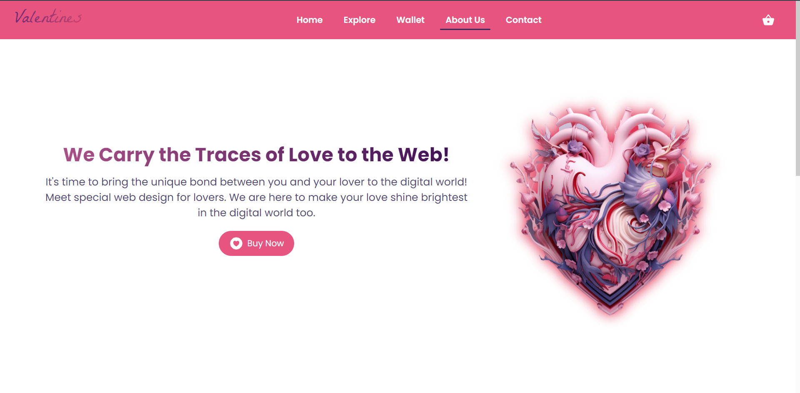

<div align="center">
  
  
  
  
[](https://twitter.com/intent/follow?screen_name=MehmettSZR)

  <br />
  <br />

  <h2 align="center">Valentiee - Private Valentines Website</h2>

  Valentines, we create your private love websites, <br />Responsive for all devices, build using HTML, CSS, and JavaScript.

  <a href="https://codewithsadee.github.io/metalink/"><strong>➥ Live Demo</strong></a>

</div>

<br />

### Demo Screeshots



### Prerequisites

Before you begin, ensure you have met the following requirements:

* [Git](https://git-scm.com/downloads "Download Git") must be installed on your operating system.

### Run Locally

To run **Valentiee** locally, run this command on your git bash:

Linux and macOS:

```bash
sudo git clone https://github.com/KeyBoarT/Valentiee.git
```

Windows:

```bash
git clone https://github.com/KeyBoarT/Valentiee.git
```

### Contact

If you want to contact with me you can reach me at [Twitter](https://www.twitter.com/MehmettSZR)
